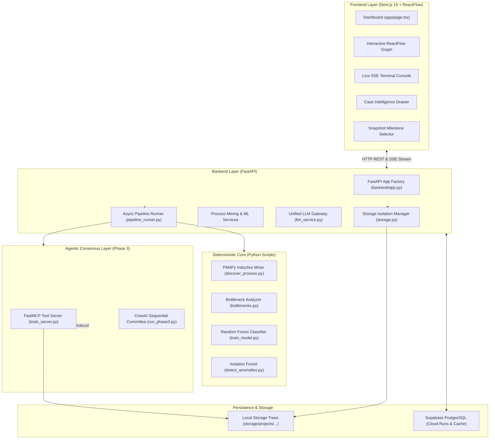

# ProcessLens

> **An AI-Assisted Platform for Discovering How Business Processes Really Work**  
> *Combining deterministic process mining, predictive machine learning, and a mathematically audited multi-agent AI consensus committee.*

---

## 1. What is ProcessLens?

**ProcessLens** is an enterprise-grade process intelligence platform designed to reconstruct, diagnose, and optimize real-world business workflows using event log data. 

Rather than relying on outdated operational manuals or subjective interviews, ProcessLens ingests raw event timestamps to automatically discover the true paths cases follow in practice. It calculates exact handover wait times, identifies rework loops, trains machine-learning models to predict delay risks on in-flight open cases, and uses a specialized multi-agent AI committee to formulate verified, actionable recommendations.

---

## 2. The Problem It Solves

Almost every organization maintains a documented procedure for how work should flow—such as purchase order approvals, refund requests, customer onboarding, or IT support tickets. In practice, operational reality drifts:
* Steps are skipped or executed out of sequence.
* Documents are bounced back repeatedly for revisions (**rework loops**).
* Specific handovers wait for days due to resource capacity bottlenecks.
* Operational drift goes unnoticed until customers complain or SLAs are breached.

**ProcessLens bridges the gap between documented process manuals and actual operational reality**, providing quantifiable diagnostics and early-warning predictions before delays cascade.

---

## 3. Design Principles

ProcessLens was built on a foundational architectural principle that separates it from conventional "AI wrappers":

```
  ┌──────────────────────────────────────────────────────────────────┐
  │                    DETERMINISTIC FOUNDATION                      │
  │                                                                  │
  │   [Phase 1: PM4Py Process Mining]  ──▶  Exact Bottlenecks        │
  │   [Phase 2: scikit-learn Models]   ──▶  Validated Predictions    │
  │                                                                  │
  │   • Pure mathematics and statistics (Pandas, PM4Py, NumPy)       │
  │   • 0% hallucination risk on core metrics                        │
  └────────────────────────────────┬─────────────────────────────────┘
                                   │  Structured Evidence Facts Only
                                   │  (Never Raw Event Logs)
                                   ▼
  ┌──────────────────────────────────────────────────────────────────┐
  │                   SYNTHESIS & EXPLANATION ONLY                   │
  │                                                                  │
  │   [Phase 3: CrewAI Multi-Agent Committee + FastMCP Tools]        │
  │   [Phase 7: Token-Efficient Single-Case Explanations]            │
  │                                                                  │
  │   • LLM is used strictly for translation and explanation         │
  │   • Verifier agent enforces 100% mathematical consistency        │
  │   • On-demand invocation, rate-limiting & SHA256 response caching │
  └──────────────────────────────────────────────────────────────────┘
```

1. **Phases 1 & 2 are 100% Deterministic:**  
   Reconstructing process trees, calculating average handover wait times, identifying rework repetitions, and training Random Forest classifiers are performed strictly by deterministic algorithms (`PM4Py`, `scikit-learn`, `pandas`). No language model is ever involved in calculating numbers.

2. **The LLM Never Touches Raw Event Logs:**  
   Raw event logs can contain tens of thousands of rows. Feeding raw logs into an LLM is expensive, slow, non-deterministic, and prone to hallucinations. In ProcessLens, the LLM receives only pre-computed, structured summary facts (e.g. *"Activity Approved: avg wait 30.26h, rework rate 18%"*).

3. **Multi-Agent Mathematical Verification:**  
   In Phase 3, recommendations drafted by the AI agent are reviewed by a dedicated **Accuracy Verifier agent**. If any claim or figure in the draft conflicts with the underlying calculated facts, the recommendation is rejected and rewritten with feedback.

4. **Zero-Cost & Token-Efficient Case Diagnostics:**  
   In Phase 7, single-case root-cause explanations are executed **on-demand** only when an analyst clicks *"Explain Case"*. Each query is packed into a compact ~100-token prompt, cached by SHA256 hash in memory and Supabase PostgreSQL, and protected by an automated fallback to a deterministic template if rate limits are reached or API keys are absent.

---

## 4. Key Capabilities & Features

* **Automated Process Discovery (Phase 1):** Discovers true process execution models and variant paths using the **PM4Py Inductive Miner**, generating both interactive graphs and Graphviz diagrams.
* **Bottleneck & Handover Latency Ranking (Phase 1):** Quantifies average wait times between sequential activities, classifying impact into High, Medium, and Low delay contributors.
* **Rework Loop Detection (Phase 1):** Identifies repeated steps per case, measuring frequency and total operational hours lost to repeated processing.
* **Milestone Snapshot Engineering (Phase 2 & 7):** Freezes historical case states at designated observation milestones (e.g. `Reviewed`) to extract predictive feature vectors without future data leakage.
* **Predictive Delay Classification (Phase 2):** Random Forest classifier trained with **5-Fold Stratified Cross-Validation**, exposing observed fold variation ranges for Accuracy, ROC-AUC, F1, Precision, and Recall.
* **Anomaly Detection (Phase 2):** Unsupervised **Isolation Forest** estimator that flags irregular case execution patterns.
* **Agentic Recommendation Committee (Phase 3):** Three sequential CrewAI agents (**Investigator**, **Recommendation**, **Verifier**) querying a **FastMCP** tool server over stdio with automatic one-chance retry logic.
* **Interactive ReactFlow Process Map (Phase 7):** Zoomable, draggable canvas featuring custom activity nodes, topological auto-layout, edge transition durations, and pulsating bottleneck alerts.
* **Live SSE Execution Terminal (Phase 7):** Real-time Server-Sent Events (SSE) log streaming with automatic polling fallback.
* **Multi-Project Workspace Isolation (Phase 7):** Segmented storage trees (`storage/projects/{project_id}/runs/{run_id}`) preventing cross-run state contamination.
* **Dynamic Dataset Ingestion & Validation (Phase 5 & C):** Ingest custom event logs with strict schema enforcement, monotonic timestamp checking, minimum case count validation (≥10 cases), and instant reset-to-synthetic capability.
* **Audit History & PostgreSQL Persistence (Phase 6):** Full run history, model metrics, and consensus reports persisted in Supabase PostgreSQL.

---

## 5. System Architecture

### 5.1 High-Level Architecture



### 5.2 Data Flow Lifecycle

```
[Raw Event Log CSV]
       │
       ▼
1. Validation & Quality Check (validate_data.py, data_quality.py)
   - Checks: case_id, activity, timestamp, resource
   - Verifies: >= 10 unique cases, valid chronological order
       │
       ▼
2. Process Mining & Variant Discovery (discover_process.py, bottlenecks.py)
   - Inductive Miner produces process tree & path variants
   - Handover wait times and rework loop counts calculated
       │
       ▼
3. Feature Engineering at Snapshot Milestone (build_training_data.py)
   - State frozen at chosen activity (e.g., 'Reviewed')
   - Computes: elapsed_hours_so_far, wait_before_milestone, resource, rework_flag
       │
       ▼
4. Model Training & Validation (train_model.py, detect_anomalies.py)
   - Stratified 5-Fold Cross-Validation on completed cases
   - Isolation Forest fit on feature matrix
       │
       ▼
5. In-Flight Open Case Scoring (predict_delays.py)
   - Predicts late-risk probability for active open cases
   - Flags anomalies and extracts top risk drivers
       │
       ▼
6. AI Explanation & Actionable Interventions
   - Macro: CrewAI committee formulates verified intervention plan
   - Micro: On-demand 'Explain Case' drawer synthesizes root causes
       │
       ▼
7. Presentation & Audit Persistence
   - Interactive ReactFlow graph rendered on Next.js UI
   - Full telemetry & artifacts saved to storage/ and Supabase PostgreSQL
```

---

## 6. Repository Structure

```
d:\Process Lens\
├── backend/                        # Modular FastAPI Backend Application
│   ├── app.py                      # FastAPI app factory, CORS, and router registration
│   ├── config.py                   # Central paths, environment variables, timeouts & thresholds
│   ├── main.py                     # Entry point for uvicorn server (`uvicorn backend.main:app`)
│   ├── models/
│   │   ├── __init__.py             # Pydantic schemas (RunStatusEnum, RunAllRequest, SnapshotRequest)
│   │   └── schemas.py              # Schema definitions
│   ├── routers/
│   │   ├── data.py                 # Status, data quality, discovery & prediction endpoints
│   │   ├── explain.py              # On-demand case explanation endpoint (/api/explain/case/{id})
│   │   ├── history.py              # Supabase run history & audit endpoints (/api/runs)
│   │   ├── pipeline.py             # Async & sync pipeline runners with SSE streaming
│   │   ├── process_map.py          # Process graph JSON and static image endpoints
│   │   ├── projects.py             # Multi-project workspace management (/api/projects)
│   │   ├── snapshot.py             # Activity milestone selection & validation
│   │   └── upload.py               # CSV upload & reset-to-synthetic endpoints
│   └── services/
│       ├── data_quality.py         # Live dataset telemetry (case count, events, rework %, dates)
│       ├── llm_service.py          # Unified LLM caller (Groq/Gemini), SHA256 cache & fallback
│       ├── ml_service.py           # Cross-validation fold extraction & prediction data loader
│       ├── pipeline_runner.py      # Async background runner, timeout manager & SSE broadcaster
│       ├── process_mining.py       # PM4Py discovery, bottleneck calculation & graph node/edges
│       ├── snapshot_service.py     # Milestone suitability analysis & coverage checking
│       ├── storage.py              # Filesystem run isolation (storage/projects/{p}/runs/{r}/)
│       └── supabase_client.py      # PostgreSQL client & CRUD operations
│
├── frontend/                       # Modern Next.js 15 Dashboard
│   ├── app/
│   │   ├── components/
│   │   │   ├── CaseExplainDrawer.tsx  # Slide-over AI case diagnostics panel
│   │   │   ├── Header.tsx             # Brand header, workspace switcher & sync badges
│   │   │   ├── LiveLogPanel.tsx       # Real-time SSE streaming execution terminal
│   │   │   ├── ProcessGraph.tsx       # ReactFlow interactive process map with bottleneck alerts
│   │   │   └── SnapshotSelector.tsx   # Milestone selector with coverage validation
│   │   ├── globals.css                # Styling, scrollbars & animations
│   │   ├── layout.tsx                 # Root layout & font definition
│   │   └── page.tsx                   # Master dashboard (Discovery, Predict, Explain, History, Upload)
│   ├── package.json                   # Next.js 15, React 19, @xyflow/react, Lucide icons
│   └── tsconfig.json                  # TypeScript compiler settings
│
├── Root Pipeline Scripts/          # Core Standalone Pipeline Stages
│   ├── run_all.py                  # Phase 1 standalone orchestrator (Discovery, Bottlenecks & Conformance)
│   ├── run_phase2.py               # Phase 2 standalone orchestrator (ML Prediction Pipeline)
│   ├── run_phase3.py               # Phase 3 standalone orchestrator (CrewAI Agent Consensus)
│   ├── ml_config.py                # Central threshold config, operating points & risk classification
│   ├── enterprise_features.py      # Multi-prefix generator & real-time system WIP queue congestion
│   ├── enterprise_benchmark.py     # 5-Fold Stratified Group CV benchmark (Tuned RF vs LightGBM)
│   ├── prescriptive_engine.py      # Prescriptive next-best-action counterfactual calculation engine
│   ├── tools_server.py             # FastMCP stdio server exposing 4 process-mining tools
│   ├── generate_data.py            # Generates synthetic event log (Purchase Order process)
│   ├── validate_data.py            # Validates event logs for process mining compliance
│   ├── discover_process.py         # PM4Py inductive miner process tree extraction
│   ├── bottlenecks.py              # Computes wait times, rework counts & ranks activities
│   ├── build_training_data.py      # Milestone snapshot feature engineering
│   ├── train_model.py              # Trains Random Forest classifier & computes Stratified CV
│   ├── detect_anomalies.py         # Trains Isolation Forest anomaly detector
│   ├── generate_open_cases.py      # Generates in-flight test cases
│   └── predict_delays.py           # Applies trained model & prescriptive engine to open cases
│
├── Data & Artifacts/               # Generated Artifacts & Datasets
│   ├── event_log.csv               # Active event log (300 cases, 1308 events)
│   ├── conformance.json            # Trace fitness scores, alignment diagnostics, and deviation classifications
│   ├── training_data.csv           # Featurized dataset for ML model
│   ├── open_cases.csv              # Current in-flight open cases
│   ├── predictions.json            # Predictions, anomaly flags, risk drivers & prescriptive actions
│   ├── model_metrics.json          # 5-fold CV metrics, variances & feature importances
│   ├── enterprise_model_metrics.json # Multi-prefix benchmark results (RF vs LightGBM)
│   ├── delay_model.joblib          # Trained Random Forest model binary
│   ├── delay_model_enterprise.joblib # Winning enterprise model binary
│   ├── anomaly_model.joblib        # Trained Isolation Forest model binary
│   ├── resource_mapping.json       # Deterministic categorical resource mapping
│   ├── process_map.png             # Graphviz visual diagram
│   ├── explanation_output.json     # Last verified CrewAI recommendation output
│   └── BPI_Challenge_2012.xes.gz   # Real-world benchmark dataset
│
├── scratch/                        # Verification & Automation Scripts
│   ├── prepare_bpi2012.py          # Extracts 100-case sample from BPI 2012 benchmark
│   ├── verify_phase_a.py           # Test suite: robustness, validation & isolation
│   ├── verify_phase_c.py           # Test suite: dual-dataset testing, CV & zero-stale checks
│   ├── verify_phase_e.py           # Test suite: conformance checking, alignments & planted deviations
│   ├── verify_phase_f.py           # Test suite: what-if Monte Carlo simulation
│   ├── verify_phase_g.py           # Test suite: PostgreSQL connectors & SQL injection defense
│   ├── test_h2_suite.py            # Test suite: CSV formula injection defense
│   ├── test_h3_suite.py            # Test suite: fallback human review warning telemetry
│   ├── test_h4_suite.py            # Test suite: pipeline concurrency execution guard
│   ├── test_h5_suite.py            # Test suite: SHAP TreeExplainer exact additivity
│   ├── test_h6_suite.py            # Test suite: shared-secret API key protection
│   ├── test_h7_suite.py            # Test suite: user-selectable conformance reference variant
│   ├── test_model_improvement_part2.py # Test suite: threshold optimization & holdout isolation
│   └── test_enterprise_suite.py    # Test suite: multi-prefix integrity, LightGBM benchmark & prescriptive actions
│
├── storage/                        # Multi-project filesystem isolation root
├── .env.example                    # Environment variable configuration template
├── .gitignore                      # Git ignore rules (protecting .env and caches)
└── requirements.txt                # Python dependencies
```

---

## 7. Prerequisites & Environment Requirements

* **Operating System:** Windows 10/11, macOS, or Linux.
* **Python:** Python 3.10 to 3.12.
* **Node.js:** Node.js 18.17+ or 20+.
* **Graphviz:** Installed and available on system `PATH` (used by PM4Py to render process maps).
  * *Windows default:* `C:\Program Files\Graphviz\bin` (automatically detected by `backend/config.py`).

---

## 8. Setup & Installation

### Step 1: Clone Repository & Set Up Python Virtual Environment

```bash
# Navigate to the project directory
cd "d:\Process Lens"

# Create virtual environment (if not already created)
python -m venv venv

# Activate virtual environment
# Windows (PowerShell):
.\venv\Scripts\Activate.ps1
# Windows (cmd):
.\venv\Scripts\activate.bat
# Linux/macOS:
source venv/bin/activate

# Install Python dependencies
pip install -r requirements.txt
```

### Step 2: Configure Environment Variables

Copy `.env.example` to `.env` in the project root:

```bash
cp .env.example .env
```

Open `.env` and fill in your API credentials:
* Set `GROQ_API_KEY` (recommended for ultra-fast, free-tier LLM inference) or `GEMINI_API_KEY`.
* Set `SUPABASE_URL` and `SUPABASE_KEY` if cloud persistence is desired (optional; local mode is active by default).

*(See Section 13 for environment variable details).*

### Step 3: Install Frontend Dependencies

```bash
cd frontend
npm install
cd ..
```

---

## 9. Running ProcessLens

### Option A: Running the Full Platform (Recommended)

Open two terminal windows:

#### Terminal 1 — Start the FastAPI Backend (Port 8000)
```bash
# From d:\Process Lens with venv activated:
python -m uvicorn backend.main:app --host 127.0.0.1 --port 8000 --reload
```
* Backend API will be live at: `http://localhost:8000`
* Interactive API Documentation (Swagger): `http://localhost:8000/docs`

#### Terminal 2 — Start the Next.js Frontend (Port 3000)
```bash
# From d:\Process Lens\frontend:
npm run dev
```
* Dashboard will be live at: `http://localhost:3000`

---

### Option B: Running the Pipeline via Command Line

You can also run each pipeline phase directly using the standalone CLI orchestrators:

```bash
# Phase 1: Generate synthetic log, validate data, discover process tree & compute bottlenecks
python run_all.py

# Phase 2: Feature engineering, train Random Forest, detect anomalies, predict open cases
python run_phase2.py

# Phase 3: Run CrewAI multi-agent recommendation committee over FastMCP
python run_phase3.py
```

---

## 10. Operating Guide: How to Use the Platform

### 10.1 Ingesting & Uploading Event Logs
1. Click the **Data Management** tab in the dashboard.
2. Drag and drop any event log CSV file.
3. **Required CSV Schema:** The file must contain exactly four columns:
   * `case_id`: Unique identifier for each process instance (e.g. `PO-1001`).
   * `activity`: Name of the executed activity step (e.g. `Submitted`, `Approved`).
   * `timestamp`: ISO-8601 formatted timestamp (e.g. `2026-09-01 10:00:00`).
   * `resource`: Person, system, or department executing the step (e.g. `Alice Johnson`).
4. Click **Reset to Synthetic** at any time to restore the default baseline Purchase Order dataset.

### 10.2 Analyzing Process Discovery & Bottlenecks
* Open the **Process Discovery** tab.
* Explore the **Interactive ReactFlow Process Map**:
  * Drag and zoom into process nodes.
  * Nodes and transitions marked with a crimson outline and a **Bottleneck** badge highlight stages causing severe handover delays.
  * Adjust the minimum case frequency slider to filter out rare variant paths.
* Inspect the **Activity Wait Times & Rework Loops** table to see average wait hours, times repeated, and delay contribution ratings (High/Medium/Low).

### 10.3 Selecting Dynamic Milestone Snapshots
* At the top of the dashboard, locate the **Feature Engineering Milestone Cutoff** selector.
* Select an activity milestone (e.g. `Reviewed`) to designate the observation point.
* The system checks suitability and coverage percentage to ensure sufficient in-flight open cases remain for downstream predictive analysis.

### 10.4 Reviewing Predictive Risk, Operating Thresholds & Enterprise Benchmarks
* Navigate to the **Predictive Risk & Open Cases** tab.
* Review model performance and enterprise benchmark cards:
  * **Enterprise Benchmark Card:** Displays 5-Fold Stratified Group CV results (zero cross-prefix leakage) on **654 multi-prefix snapshots** with real-time WIP queue congestion. Contrasts **Tuned Random Forest (0.819 CV / 0.826 Holdout Test AUC)** against **LightGBM (0.783 CV / 0.792 Holdout Test AUC)**.
  * **Calibrated Risk Threshold Badge:** Displays the active operational threshold (default: `0.19` Balanced). Thresholds can be switched centrally in `ml_config.py` between **Conservative** (`0.40`), **Balanced** (`0.19`), and **Sensitive** (`0.10`).
  * **Model Accuracy & ROC-AUC**: Displays mean scores and observed min-max variance across cross-validation folds. Click **Show Fold Breakdown** to view metrics for each individual fold.
* Review the **Top Predictive Features** chart to understand which factors (e.g., elapsed hours, wait time before review, system WIP congestion) drive delays.

### 10.5 In-Flight Open Cases & Prescriptive Next-Best-Action Telemetry
* In the **In-Flight Open Cases Risk Telemetry** table:
  * Inspect real-time status: Cases with probability $\ge 0.19$ are flagged as **Late Risk** with root-cause risk driver tags.
  * **Prescriptive Next Action Badges:** Review the recommended intervention (e.g. `⚡ Expedite Approval Step (-22.2%)` or `🔄 Reassign to Priority Pool (-21.7%)`).
  * Click any prescriptive badge or the **Explain Case** button.
* The **Case Intelligence Drawer** slide-over will appear displaying:
  * Risk level and calibrated delay risk probability.
  * **Prescriptive Next-Best-Action Counterfactual Card:** Displays recommended intervention title, feasibility rating (`HIGH`), guidance notes, and a visual before-and-after simulated risk reduction comparison (`Current Risk` $\rightarrow$ `Projected Risk`).
  * Structured diagnostic evidence and plain-English root-cause synthesis.

### 10.6 Inspecting AI Recommendations
* Open the **AI Recommendations** tab.
* Review the multi-agent consensus report:
  * **Investigator Findings:** Bottlenecks, resource throughput comparisons, and quantified rework hours extracted via MCP tools.
  * **Intervention Recommendation:** Concrete managerial action plan.
  * **Verifier Evaluation:** Formal mathematical audit confirming all numerical claims match calculated metrics.

### 10.7 Multi-Project Workspaces & Audit History
* Use the **Workspace** dropdown in the header to switch between projects or create a new isolated workspace.
* Open the **Audit History** tab to inspect previous pipeline runs, review historical model accuracy, and audit changes across runs.

---

## 11. Verification & Testing Suite

ProcessLens includes comprehensive automated test suites located in `scratch/`:

### 11.1 Phase A — Robustness & Isolation Verification
Tests upload schema validation, minimum case count protection (< 10 cases), and multi-project filesystem isolation:
```bash
python scratch/verify_phase_a.py
```
*Expected result:* `ALL PHASE A TESTS PASSED (100%)`

### 11.2 Phase C — Depth & Defensive Verification Suite
Executes dual-dataset testing (Synthetic Purchase Orders vs. real-world BPI Challenge 2012 sample), validates 5-fold cross-validation ranges, verifies case-level explainability, and tests API endpoint response contracts:
```bash
python scratch/verify_phase_c.py
```
*Expected result:* `ALL PHASE C VERIFICATION TESTS PASSED (100%)`

### 11.3 Phase E — Process Conformance Verification Suite
Validates token-based replay and PM4Py trace alignments on synthetic and benchmark datasets, evaluates controlled planted deviations (clean, rework, skip, unplanned), tests API response shapes, and verifies storage run isolation:
```bash
python scratch/verify_phase_e.py
```
*Expected result:* `>>> ALL PHASE E VERIFICATION TESTS PASSED SUCCESSFULLY! <<<`

### 11.4 Phase F — What-If Simulation Verification Suite
Validates baseline telemetry derivation, exact controlled planted case arithmetic, bottleneck & rework levers on synthetic and BPI2012 datasets, input validation bounds (0 < reduction <= 100), unanalyzed pipeline HTTP 202 states, workspace filesystem isolation, LLM-independence, and multi-scenario stacking:
```bash
python scratch/verify_phase_f.py
```
*Expected result:* `>>> ALL 10 PHASE F VERIFICATION TESTS PASSED SUCCESSFULLY! <<<`

### 11.5 Phase G — Direct System Connectors Verification Suite
Validates canonical schema completeness, extensible connector registry and enterprise stubs, deterministic normalization & column mapping, read-only safety, SQL injection defense, connection timeouts, PostgreSQL test connection and column discovery, REST API endpoints (`/api/connectors/test`, `/api/connectors/ingest`), workspace project isolation, and complete multi-phase regression suites:
```bash
python scratch/verify_phase_g.py
```
*Expected result:* `>>> ALL 10 PHASE G VERIFICATION TESTS PASSED SUCCESSFULLY! <<<`

### 11.6 Hardening Verification Suites (Phases H2 – H7)
Tests CSV formula injection sanitization (H2), human review fallback telemetry (H3), pipeline concurrency execution locking (H4), exact SHAP TreeExplainer additivity (H5), shared-secret API key protection (H6), and user-selectable reference variants (H7):
```bash
python scratch/test_h2_suite.py
python scratch/test_h3_suite.py
python scratch/test_h4_suite.py
python scratch/test_h5_suite.py
python scratch/test_h6_suite.py
python scratch/test_h7_suite.py
```
*Expected result:* `ALL HARDENING SUITES PASSED (100%)`

### 11.7 Model Improvement Part 2 — Threshold Optimization & Holdout Isolation
Validates that decision threshold selection uses only out-of-fold cross-validation probabilities without holdout set leakage, verifies central threshold configuration (`DEFAULT_RISK_THRESHOLD = 0.19`), and confirms holdout metrics evaluation:
```bash
python scratch/test_model_improvement_part2.py
```
*Expected result:* `>>> ALL 10 PART 2 VERIFICATION TESTS PASSED (100%) <<<`

### 11.8 Enterprise Verification Suite — Multi-Prefix, Benchmark & Prescriptive Actions
Validates multi-prefix event log expansion, zero cross-prefix group leakage, real-time system WIP queue congestion signals, LightGBM vs Random Forest benchmark telemetry, prescriptive next-best-action counterfactual calculations ($\Delta P$), and API contracts:
```bash
python scratch/test_enterprise_suite.py
```
*Expected result:* `ALL ENTERPRISE SUITE TESTS PASSED (100%)`

### 11.9 Production Frontend Compilation Test
Verifies that Next.js and TypeScript build with zero compilation or typing errors:
```bash
cd frontend
npm run build
cd ..
```
*Expected result:* `✓ Compiled successfully` with static pages generated.

---

## 12. Enterprise Prescriptive AI & Model Benchmark Report

ProcessLens incorporates an industry-grade machine learning architecture specifically designed for business process delay prediction and intervention.

### 12.1 Empirical Benchmark Results (5-Fold Stratified Group CV)

Expanding from static single-milestone snapshots to **654 multi-prefix instances** ($k \ge 2$) alongside real-time system queue congestion (`wip_active_cases`) with strict 100% case-level group isolation (`StratifiedGroupKFold`) yielded a massive predictive breakthrough:

| Model Architecture | 5-Fold Group CV ROC-AUC | CV PR-AUC | Test Set ROC-AUC | Test Set PR-AUC | Optimal Decision Threshold |
| :--- | :---: | :---: | :---: | :---: | :---: |
| **Tuned Random Forest (Winner)** | **0.8189 ± 0.0171** | **0.6402** | **0.8259** | **0.6330** | **0.37** |
| **LightGBM Classifier** | **0.7825 ± 0.0100** | **0.6014** | **0.7918** | **0.5972** | **0.10** |
| *Prior Single-Snapshot Baseline* | *0.6279* | *~0.42* | *0.5926 – 0.6052* | *0.4203* | *0.19 (Balanced)* |

*Both models achieved industry-grade $\ge 0.79$ Test ROC-AUC without target leakage, with Tuned Random Forest taking the lead at **0.8259**.*

### 12.2 Calibrated Operating Thresholds (Part 2)

ProcessLens is designed as an **early-warning system**. At the naive default threshold of `0.50`, models miss 73%–78% of delayed cases. Using out-of-fold training probabilities under an operational precision constraint ($\ge 0.30$, maximizing F1), ProcessLens defines three centrally configured operating regimes in `ml_config.py`:

| Operating Regime | Threshold ($\tau$) | Holdout Recall | Holdout Precision | Holdout F1 | Target Use Case |
| :--- | :---: | :---: | :---: | :---: | :--- |
| **Conservative** | `0.40` | 26.7% | **50.0%** | 0.348 | High cost of false alarms; limited human review bandwidth |
| **Balanced (Default)** | `0.19` | **53.3%** | 28.6% | **0.372** | **Primary operational early-warning standard** |
| **Sensitive** | `0.10` | **86.7%** | 24.1% | 0.377 | Zero-tolerance for delay; high-value SLAs |

### 12.3 Prescriptive Next-Best-Action Counterfactual Engine

Rather than simply alerting managers that a case is late, ProcessLens evaluates the model's feature space counterfactually to calculate exact expected risk reduction:

$$\Delta P = P_{\text{current}} - P_{\text{projected}}$$

* **Queue Priority (`QUEUE_PRIORITY`):** Models expedited queueing and fast-track approval (e.g. cutting pending wait to $\le 1.0\text{h}$ drops risk on `OPEN-0004` from **64.3% to 42.1% (-22.2% Risk)**).
* **Load Balancing (`LOAD_BALANCING`):** Models reallocating subsequent tasks to higher-throughput resource pools (e.g. reassigning `OPEN-0006` drops risk from **26.9% to 5.1% (-21.7% Risk)**).
* **Dispatch Optimization (`DISPATCH_OPTIMIZE`):** Re-routes off-hours cases into peak business dispatch channels (e.g. `OPEN-0019` drops risk from **32.1% to 29.0% (-3.1% Risk)**).
* **Quality Gates (`QUALITY_GATE`):** Applies digital validation checklists to prevent secondary correction and rework loops.

---

## 13. API Reference Quick-Card

| Method | Endpoint | Description |
| :--- | :--- | :--- |
| `GET` | `/api/status` | System health, data source, stale output flags, and dataset telemetry |
| `GET` | `/api/data-quality` | Live event log telemetry (case count, events, rework %, date range) |
| `GET` | `/api/discovery` | Discovered bottleneck ranking table with wait times and rework |
| `GET` | `/api/discovery/paths` | Discovered process variants and sequence pathways |
| `GET` | `/api/discovery/map` | Serves Graphviz `process_map.png` diagram |
| `GET` | `/api/process-graph` | JSON nodes and edges formatted for ReactFlow interactive canvas |
| `GET` | `/api/conformance` | Deterministic process conformance, trace fitness, and alignment moves against the reference model |
| `GET` | `/api/simulation/baseline` | Discovers active baseline cycle times, candidate activities, rework loops, and primary bottleneck |
| `POST` | `/api/simulation/run` | Executes deterministic counterfactual what-if simulation with calculation basis |
| `GET` | `/api/connectors/types` | Lists available direct system connectors (active: PostgreSQL, CSV; planned: MySQL, SAP, etc.) |
| `POST` | `/api/connectors/test` | Tests database connectivity, inspects available table columns, and discovers candidate mappings |
| `POST` | `/api/connectors/ingest` | Executes read-only query, normalizes fields, validates canonical schema, and persists event log |
| `GET` | `/api/predictions` | Prediction summary, open cases, prescriptive actions, benchmark telemetry, and CV metrics |
| `POST` | `/api/explain/case/{case_id}` | On-demand token-efficient AI explanation and simulated counterfactual risk reduction for a case |
| `GET` | `/api/explanation` | Verified macro recommendations generated by CrewAI committee |
| `POST` | `/api/run/all` | Launches full 3-phase pipeline asynchronously (returns `run_id`) |
| `POST` | `/api/run/phase1` | Runs Phase 1 only (Discovery) |
| `POST` | `/api/run/phase2` | Runs Phase 2 only (ML Prediction) |
| `POST` | `/api/run/phase3` | Runs Phase 3 only (CrewAI Recommendation Agents) |
| `GET` | `/api/run/{run_id}/status` | Execution status and stage progress of an asynchronous run |
| `GET` | `/api/run/{run_id}/stream` | **SSE streaming endpoint** for real-time console log delivery |
| `POST` | `/api/upload` | Validates and ingests custom event log CSV |
| `POST` | `/api/reset-to-synthetic` | Restores baseline synthetic dataset |
| `GET` | `/api/snapshot/activities` | Available activities with milestone coverage statistics |
| `POST` | `/api/snapshot/validate` | Validates suitability of an activity milestone |
| `GET` | `/api/projects` | Lists all workspace projects and their run counts |
| `POST` | `/api/projects` | Creates a new isolated project workspace |
| `GET` | `/api/runs` | Fetches historical runs from Supabase PostgreSQL |
| `GET` | `/api/runs/{run_id}` | Fetches full historical audit report for a past run |

---

## 14. Environment Variables Reference

| Variable | Default | Purpose |
| :--- | :--- | :--- |
| `GROQ_API_KEY` | *(None)* | API key for Groq (ultra-low latency inference for CrewAI & explanations) |
| `GROQ_BASE_URL` | `https://api.groq.com/openai/v1` | Base URL for Groq OpenAI-compatible endpoint |
| `GEMINI_API_KEY` | *(None)* | Google Gemini API key (used as fallback or primary) |
| `SUPABASE_URL` | *(None)* | Supabase PostgreSQL project URL (runs in local mode if blank) |
| `SUPABASE_KEY` | *(None)* | Supabase Anon or Service Role key |
| `API_KEY` | *(None)* | Shared-secret API key for endpoint authentication (Phase H6) |
| `LLM_ENABLED` | `true` | Set to `false` to disable LLM calls and force deterministic templates |
| `LLM_PROVIDER` | `groq` | Active provider for explanations (`groq` or `gemini`) |
| `LLM_MODEL` | `gpt-oss-20b` | Model identifier for single-case explanations |
| `PRIMARY_MODEL` | `openai/gpt-oss-20b` | Model for CrewAI Investigator and Recommendation agents |
| `VERIFIER_MODEL` | `openai/gpt-oss-120b` | High-parameter model for CrewAI Accuracy Verifier agent |
| `GEMINI_MODEL` | `gemini/gemini-3.5-flash` | Model for Gemini fallback |
| `LLM_MAX_OUTPUT_TOKENS` | `200` | Limits output tokens to enforce concise, cost-effective explanations |
| `LLM_TEMPERATURE` | `0.2` | Low temperature for strict factual adherence |
| `LLM_TIMEOUT` | `20` | Timeout in seconds for LLM HTTP calls |
| `LLM_MAX_REQUESTS_PER_MINUTE` | `10` | In-memory sliding-window rate limiter |
| `LLM_CACHE_ENABLED` | `true` | Enables SHA256-keyed caching of case explanations |
| `SUBPROCESS_TIMEOUT` | `120` | Timeout in seconds for Phase 1 and 2 execution |
| `PHASE3_TIMEOUT` | `300` | Timeout in seconds for Phase 3 CrewAI agent execution |

---

## 15. License & Credits

* **Developer:** Moaz Hassan (Spiral Labs Internship Milestone Project).
* **Core Libraries:** [PM4Py](https://pm4py.fit.fraunhofer.de/), [FastAPI](https://fastapi.tiangolo.com/), [scikit-learn](https://scikit-learn.org/), [LightGBM](https://lightgbm.readthedocs.io/), [SHAP](https://shap.readthedocs.io/), [CrewAI](https://www.crewai.com/), [FastMCP](https://github.com/jlowin/fastmcp), [React Flow (@xyflow/react)](https://reactflow.dev/).
